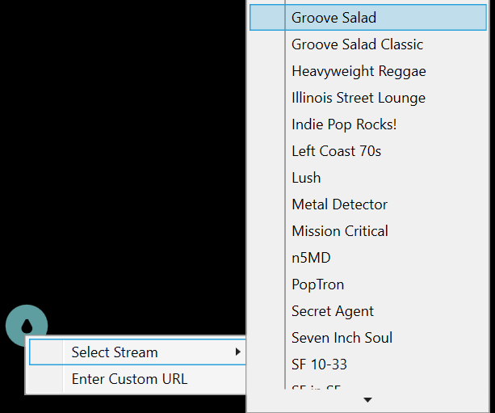

# Beaver Receiver

## Movable button for Windows

The Beaver Receiver application adds a simple on/off button, which starts or stops an audio stream.

The audio source is configurable from the button's context (right-click) menu, with [Groove Salad](https://somafm.com/groovesalad/) used by default.

Click the button to turn the stream on or off:

   indicates the stream is started

   indicates the stream is stopped

* Click and hold to move the button to a new position on the screen (hold for at least one second to avoid toggling playback).

* Roll the mouse wheel (scroll up/down) over the button to adjust the volume.

* Right-click the button to select from a prepopulated list of streams from [somafm.com](https://somafm.com/)

* Or enter a custom URL. 

* Hover over the button to see the current selection.

    
* The button's position and source selection are preserved between application launches.

Click on the icon on the menu bar to show/hide the button or exit the application.

_____

## Installation
* Minimum version: Windows 10
* Build and testing: Windows 10 Pro (21H1), Windows 11 Pro (23H2)

### Notes 

* The application is currently unsigned, so clicking "More Info" and choosing "Run anyway" is required the first time the application is launched. View the source code [here](Source).
* The application allows user input, and barely checks the syntax. It does as little as possible to simply start or stop a selected stream. I'm not responsible for anything else that may happen on your system. View the source code [here](Source).
* Since nothing is installed by the application, removal is as simple as deleting the Beaver Receiver folder (no uninstall required).
* That also means it doesn't run in the system tray or prompt to add a shortcut to launch after installing, so you'll need to handle that part of the configuration.
 
Download and unzip [Beaver Receiver.zip](/Windows/Application/Beaver_Receiver.zip) and put the folder somewhere handy. Find the application inside to launch Beaver Receiver. Once running, it can be pinned to the Taskbar or added to Startup programs, etc.
